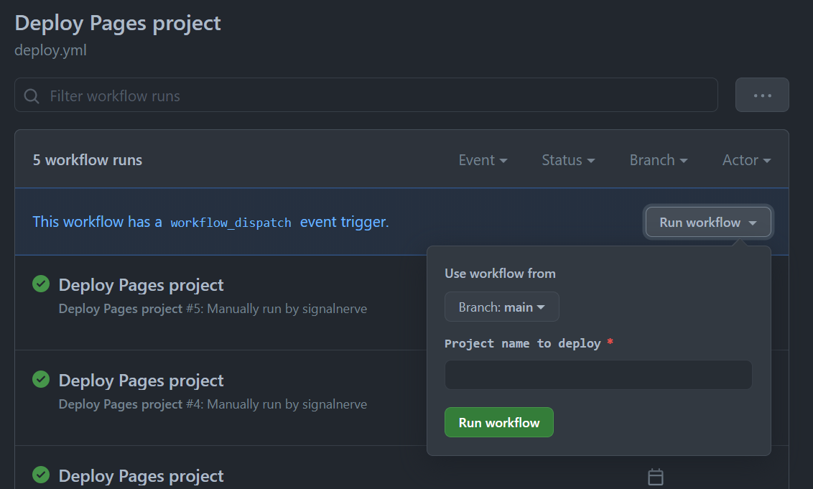

# pages-trigger

_Ad-hoc deployments for [Cloudflare Pages](https://pages.dev) projects using GitHub Actions_

This codebase allows you to use the "Create deployment" endpoint to arbitrarily deploy existing projects, using GitHub Actions.

## Setup

[Fork this repository](https://github.com/signalnerve/pages-trigger/fork) and set the following secrets in your project's _Secrets_ page:

- `CF_API_KEY`: your _Global API Key_. In the future, you'll be able to set a Pages-specific API token that only has access to your Pages projects, but for now, your Global API Key gives you access to Pages resources.
- `CF_ACCOUNT_ID`: the Cloudflare Account ID that contains your Pages projects.
- `CF_EMAIL`: your Cloudflare email.

## Usage

### Workflow Dispatch (UI deployment)

Visit the _Actions_ tab on your repository - you may need to manually enable Actions running on your repo fork. Once enabled, go to the "Deploy Pages project" workflow, and manually trigger a deploy in the UI, providing a project name to deploy.

### Repository Dispatch (API/automatic deployment)

You can automate deployments using this workflow via the `repository_dispatch` event. Send an API request to your repo's dispatch endpoint (`POST /repos/{owner}/{repo}/dispatches`), specifying a `project_name` inside of the `client_payload`. For an example cURL request, see [`examples/repository_dispatch.sh`](https://github.com/signalnerve/pages-trigger/tree/main/examples/repository_dispatch.sh).
